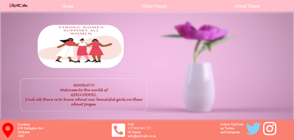

# Dom-Manipulation

[LIVE DEMO](https://thamimk.github.io/Dom-Manipulation/)

## Colabrorators:
Nonny [Nonny-Mahao] and Thami [ThamiMk]

## Discription :
This is a Resume website created to showcase students at Girlcode

This project was built using **HTML**, **CSS** and **JavaScript**.
## Tools used : *Visual Studio Code*

## Features to be implemeted in the future 
* Allow other GirlCoders to uplaod their personal profiles. 

### How to Install Your Project
1. Find  ThamiMk/First-Website on github
2. Click the green code button
3. Click the clipboard icon [Copies the link]
4. Right click on your personal desktop and select Git Bash here (Git download necessary)
5. Once a terminal opens - type: **git clone [paste copied link]** and press enter
6. direct to file in the terminal - type: **cd [file name of copied link]** and press enter
7. lastly type: **code .** and press enter
8. A compatible code editor will open the app 

### How to Use The Project
1. Open the project on a code editor (VS CODE PREFERD)
2. Right click *index.html*
3. Select *Open with live share* OR select *Copy path* and paste the link in a browser.

### Licence
This project is MIT licensed.
